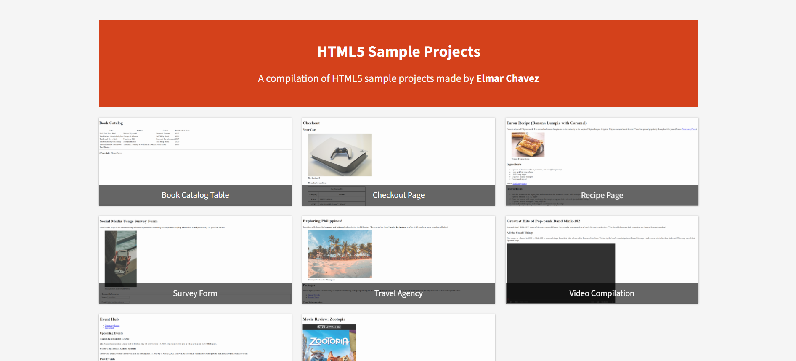

# 📁 HTML5 Sample Projects Compilation

## ℹ️ PROJECT SUBTITLE

INSERT A BRIEF DESCRIPTION OF THE PROJECT.

---

## 🔍 Overview

WHAT THIS PROJECT CONTAINS AND A LIST OF WHAT I DID IN THE PROJECT.

---

## 📚 Included Projects

INSERT A LIST AND ITS DESCRIPTION OF THE INCLUDED PROJECTS IN THIS PROJECT

---

## 🧠 What I Learned

INSERT LIST OF WHAT I LEARNED MAKING THIS PROJECT

---

## 🛠️ Tech Used

- HTML5

---

## 🚀 How to Run

1. Clone the repository
2. Navigate to this project folder
3. Open `index.html` in your browser

---

## 🌐 Live Demo

Or you can check out the 👉 [live website here](INSERT LINK HERE)

---

## 🧑‍💻 Author

Created by **Elmar Chavez**

🗓️ Month/Year: **INSERT MONTH AND YEAR**

📚 Journey: **INSERT WHAT MONTH** month of learning _frontend web development_.
